# Data-Scientist-Intern

## Agenda (12-02-2024)
1. KNN Imputation
2. Feature important using decision tree
3. Regulization also help us to understand feature important.

4. Hadoop
   + HFES - use to store the data in multiple partation
   + Map Reduce - help you to Process the data
   
#### Spark
+ Spark - new way to process data is spark not map reduce
+ Spark - also help us to analyse the data
+ best (HDFS + Spark)
+ HDFS - HDFS is use to store the large data
+ SparkSQL 
+ MLlibs for spark(similar to sklearn library)
+ Spark Streaming
+ you can apply spark on (csv, json, etc)

__Important notes__
 1. train and text score is used to find the overfitting and underfitting.
 2. if data become very big or data are in different places then doing with the pandas will be very difficult.

### Data Enginerring


#### HDFS
to take out the data from HDFS we need to use
- Apache SQOOP
- Apache Fluma
 
DA, ML, DL, NLP, CV, LLM
Spark
Cloud

#### from where data can be generated
1. IOT sensor
1. Google Form
1. Web Scrapping
1. more...

#### How to analyse and handle the big data
1. Map Reduce
2. Apache Spark

#### How to extract the data from HDFS
1. ApacheSQOOP
2. Apache Flume

#### Data Warehouse
1. AWS Redshift
1. Snowflack

#### dependence management(orchastrating)
1. Apache Airflow

#### Tools to take out data from data warehouse
1. SQL

Date - 13-02-2024
## Advance Stats DA
1. __Descriptive Stats__
   def : help us to describe the historial data.
   - Allow us to build reports(Summary of data)
   - Visulization
   - help to build Visual Dashboard
   - enemy: missing value, outliers

2. __Infrential Stats__
   - Estimation, appoximation
   Q. need of estimation and approximating something
   + A. Data collection is very expensive so we estimate the data
   + example 1: What is avg age of an indian citizen?(pandas, spark can easly find the mean)
   + example 2: total population of india just an estimate. 
   becz counting all people is very difficult

### Population 
   - collection of data
   - example- age of all the indian citizen

### sampling
- what is good sample?
   + low bias, random, varity.
- 
- subset of population, which represent the entire population.
- if you don't have enough money to collect the data we do sampling.
- we randomly collecting the data.
- it is not possible to collect the data of 1.4 billion of data, it is depend upon the budget of the company.

Q. what is the avg salary of the population?
Q. what is the avg age of the populaiton?
- do a data collection at very small scale becz
   + time consuming
   + collecting data is very expensive.

### Good Sampling Techinque
   1. **Uniform random sampling**:
      + it is randomly picking data points, giving equal chance to each and every data points.
      + in  case of salary, bias will come because of outliers.(there is sampling bias)

### Estimate can be corrupted:
1. wrong sampling techinque
1. sample contains outliers
1. sample size is not large enought

### samples mean

step to computer
1. pick 'm' sample of size 'n'
2. computer avg of each samples
3. we will end up getting, sampling distribution of samples mean.

### Estimation
- **1. Point estimation** - not so good 
- **2. Central limit theorum** is use to estimate, or make better inference/apporximation/estimation on the entire population using a small random sample.

### central limit theorum
   + find out point estimation of multiple
    sample
   + We take differnt samples from population and find out the average.
### Conculsion of central limit theorum
- more the data better is the estimate
- x-bar follow normal distribution.
- sampling distiributiion average is approxtly similar to mean of the population
- Normal distribution with mean and standard deviation
- samples mean(X) = poplulaiton mean
- 

> Sampling distributin follow the Normal distribution/Gaussain, there are 3 observation, learn it.

> Q. What is the avg height of gorilla? <br> 
ans - take sample and find it average

### to make sure if the data is follow normal discribution.

- we can tranform the any distribution to the normal distribution using

### Implement CLT on this data using python
```python
sns.histplot(population_df['age'], kde=True)
print('Number of rows: ', population_df.shape[0])
print('Population Mean: ', population_df['age'].mean())
```


```python
def sampling_distribution(data, sample_size, number_of_sample):
    sample_means = []
    for m in range(number_of_sample):
        sample = data.sample(n=sample_size)
        sample_means.append((sample_size, sample.mean()))
    sampling_distribution_df = pd.DataFrame(sample_means, columns=['n', 'mean'])

    print("*"*20, " R E P O R T ", "*"*20)
    print("Mean Check")
    print("Sampling Distribution Mean:", sampling_distribution_df["mean"].mean())
    print("Population Mean: ", data.mean())

    print()
    print("Standard Deviation Check")
    print("Sampling Distribution Std:", sampling_distribution_df["mean"].std())
    print("Population Std / (sample_size)**0.5:", data.std()/np.sqrt(sample_size))

    print("*"*55)
    
    return sampling_distribution_df
```

```python
def sampling_distribution_plot(data):
   fig, axes = plt.subplots(1, 2, figsize=(8, 3), constrained_layout=True)
   
   axes[0].set_title("Sampling Distribution")  # Add a title to the axes
   axes[0].set_xlabel('Mean')  # Add an x-label to the axes
   axes[0].set_ylabel('Density')  # Add a y-label to the axes

   sns.histplot(data, kde=True, ax=axes[0])
   
   stats.probplot(data, dist=stats.norm, plot=axes[1])
   axes[1].grid()
   
   plt.show()
```

```python
n=50
m=100

sampling_distribution_df = sampling_distribution(data=population_df['age'], sample_size=n, number_of_sample=m)

sampling_distribution_plot(data=sampling_distribution_df["mean"])
```


### Statistical Test in Python

link - https://github.com/bansalkanav/Machine_Learning_and_Deep_Learning/blob/master/Module%203%20-%20Advance%20Data%20Analysis%20and%20Statistics/6.%20Performing%20Statistical%20Test/statistical_test_practical_implementation.ipynb
Important Hypothesis Tests
There are many hypothesis tests. Here is a list of few most important tests:

### Univariate
- **Chi-Square Goodness-of-Fit Test**(cat): Tests whether the observed frequencies of categorical data match the expected frequencies according to a specified distribution. (univariant cat feature)
- **Shapiro-Wilk Test**(Numerical Continues): The Shapiro-Wilk test is a statistical test that checks whether a dataset follows a normal distribution.(less then 5000 data points, univ num continus feature)
-**Kolmogorov-Smirnov Test**: Tests whether a sample comes from a specific distribution (not limited to normal distribution). It can be used to compare any two continuous distributions.
One-Sample t-test: Tests whether the mean of a single sample is significantly different from a known or hypothesized population mean.

### Bivariate
- **Pearson Test**: Tests whether two samples have a linear relationship.(num-num), it show probabality linear relationship exist. Spearman's Rank Correlation (Alternative for Pearson Test)
- **Two-Sample t-test**: Compares the means of two related samples (e.g., before and after treatment) to determine if there is a significant difference.(cat-num, for 2 cardinate(height vs gender)) Mann-Whitney U Test (Wilcoxon Rank-Sum Test) (Alternative for 2-sample t-test)
- **ANOVA (one_way_anova)**: Compares the mean of three or more samples. It helps determine if there is a significant difference between the samples.(more then 2 cardinate(feature), Cat-num). Kruskal-Wallis Test (Alternative for One-Way ANOVA Test)
- **Chi-Square Test of Independence**: Tests whether there is a significant association between two categorical variables in a contingency table.(cat-cat) what kind of relationship is there?
(can apply on gender and count of gender)


# Web Application Development


### Client Server Architecture/ Request Respose Architecture


### DNS Server
```
find out the address of the server, using url.
DNS know store all the website address.
it is like phone book directly, which contain, url and IP Address associated with it.
```

### what is server?
```
It is a computer, that can serve multiple request at a time.
It has RAM, MEMORY, and CPU.
```

### what is the difference between in client machine and server machine?
```
Server Machine is faster then our personal computer(client machine).
Bigger CPU, Bigger RAM, Bigger Processing, so these server product lot of heat
```

### help us to build Application server:
- Flask, Django, FastAPI using python

### help us to build Web page
- HTML, CSS, JS


- FTP: send file, data
- SFTP: send large data
- SMTP: send email
- HTTP: text tranfer protocall, transfering the text, not secure
- HTTPs: send text file securly
in order to communicate and send  data you need one of the protocal.


### Response-Status Code


### How to make request uisng Python


### Create our own server(Apllication server & DB)


### create virtual environment
1. __Create__ : python -m venv .env_flask_day_2 
2. __activate__ : .env_flask_day_2\Scripts\activate
3. __Check all dependency__ : pip list
4. __install Dependency__ : Flask, Pandas, Numpy, Matplotlib 
5. __deactivate__ : .env_flask_day_2\Scripts\deactivate

### Flask
```python
# this is application program
from flask import Flask
app = Flask(__name__) #intilize the flask object

# by default get request
@app.route('/', methods=['Post']) #crate a route/endpoint and bind to some function
def index():
    return "Welcome to this application"

@app.route('/about')
def about():
    return "This is about Page"

if __name__ == '__main__':
    app.run()
```

#### Get Resquest

### Sending Varible data between client and server
- 127.0.0.1:5000/add?a=6&b=10
- capture the varible from url and send it to endpoint bind function.

```python
from flask import Flask, request

@app.route('/magic')
def add_fun():
   var_1 = int(request.args.get('a'))
   var_2 = int(request.args.get('b'))
   return str(var_1+var_2)
```

### Send HTML instade of string
```python
from flask import Flask, render_template
app = Flask(__name__) #intilize the flask object

@app.route('/') #crate a route/endpoint and bind to some function
def index():
    return render_template("home_page.html")
```

### HTML
```
- HTML is not a programming language.
- define a way of formating & structuring content.
- Two type of HTML Tag
   - Self-closing tage
   - Tags with closing tags
- HTML start with Doctype
- Tag having Attributes:
   + Input Attributes: help the client to take user input
      <input type = " ">
         1. Button
         2. Text
         3. Date
         4. Email
         5. Number
         6. more...
```


```html
<!DOCTYPE html>
<html lang="en">
<head>
    <meta charset="UTF-8">
    <meta name="viewport" content="width=device-width, initial-scale=1.0">
    <title>Document</title>
</head>
<body>
    <p> Welcome to the home page. hope to see you again very soon.</p>
</body>
</html>
```

form tage help us to send data from client to server.
form tag attributes:
   1. Action: action to performed when click be performed.
   2. Method: Post, help to secure the email, & password.

```html
<!DOCTYPE html>
<html lang="en">
<head>
    <meta charset="UTF-8">
    <meta name="viewport" content="width=device-width, initial-scale=1.0">
    <title>Document</title>
</head>
<body>
    <h1> Welcome to the home page.</h1>
    <p>hope to see you again very soon.</p>

   <!-- Data hidden in this request, do not send data using get method because it is hightly insecure, use Post to send the data-->
    <form action="/magic">
        <input type="text" name="a"> <br>
        <input type="text" name="b">
        <input type="submit">
    </form>
    
</body>
</html>
```

### API for calculator
```html
<form action="/magic" method="get">
      <input type="text" name="a" placeholder="Enter First Number"> <br> <br>
      <input type="text" name="b" placeholder="Enter Second Number" > <br> <br>
      <input type="submit" value="Add">
   </form>
```

```python
@app.route('/calculator', methods=['get'])
def cal():
    return render_template("input_page.html")

@app.route('/magic', methods=['get'])
def add_fun():
    var_1 = int(request.args.get('a'))
    var_2 = int(request.args.get('b'))
    sum = var_1 + var_2
    return str(sum)
```

### API for Login
```html
<form action="/save_login" method="POST">
        <input type="email" name="email" placeholder="Enter Email"> <br> <br> 
        <input type="password" name="password" placeholder="Enter password"> <br> <br>
        <input type="submit" value="Login">
   </form>
```

```python
@app.route('/login')
def log():
    return render_template("login.html")

@app.route('/save_login', methods=['POST'])
def save_cred():
    email = request.form.get('email')
    password = request.form.get('password')
    cred = email+" "+password
    return cred
```

### if else condition on HTML
```html

    <h1>Thanks for registering {{ uname}}</h1>

    <h1>Please go home kid</h1>

```
### for loop on HTML
```html
<ul>
    
        <li>{{ note }}</li>
    
    </ul>
```

### Create dynamic route
```python
@app.route("/in/<user_name>)
def user_profile(user_name):
    return rander_templates("thankyou.html", uname=user_name)
```
# AWS Cloud
### How to create an app?
step-by-step
 1. install python
 1. create a venv
 1. download & install all the project dependency
    - pip install -r requirment.txt
 1. crate a python project
 1. run & test the project
    * python app.py
    - run on localhost
    - run on local area net
 1. deploy the application on AWS 

### Step to deploy on AWS:
1. AWS --> Crate an account
1. Rent a server(EC2) --> Configration(RAM, Storage, CPU, OS)
    * based on the configration you will get the bill/price
    * example: 1bhk vs 3bhk price
    * not EBS(Paas)
1. Transfer the project from local to AWS server
    * `SCP - Secure copy protocol`
1. configure the server:
    `remotly access the computer using SSH(secure shell).`
    1. install python
    1. install depedencies
    1. Run the applicaton


Soluction: Rent a server
example: opening a pizza store at start
Cloud service:
- Virtual for us and physical for them
1. Amazon(AWS) --> services, EC2(Iaas), EBS(Paas)
1. Google(GCP)
1. Microsoft(Azure)

They provide service in 3 format
1. SAAS(software as an service) --> Google Docs, Colab, Drive
2. IAAS(interface as an service) --> AWS EC2
3. PAAS(platform as an service) --> AWS EBS

EBS vs EC2


revanth christober


## Create AWS EC2 Instance
Step 1: Launch an Instance


Step 2: Name and tags


Step 3: Select OS images


Step 4: instance type


Step 5: key pair; to connect to our local system we need some key. connection type `SCP`, `SSH`.
`create public private key`


Step 6: Click on Launch Instance


Step 7: EC2 instace created


Step 8: go to instance
 <br>
 <br>
 <br>

Step 9: Secure the server, lot of people are comming to my server, and we are allow the person who is coming to my server. 


Step 10: Add this `anywhere` secuity groups on my network interface.


Different services of AWS
1. **Amazon SageMaker**: it is used to build, train and deploy mechine learning models.
2. **s3**- storage in clound
3. **RDS** - Managed Relational Database Service
4. **RedShift** - Fast, simple, cost-effective Data Warehousing.
5. **Athena** - Serverless interactive analytics service, all you EDA everything done on athena instead of using you systems
6. **EC2**- we are learning this

## Hosting the web app on AWS
Step 1: Connect to instance


Step2: Go to app folder and start `CMD`


Step 3: `SSH` - use the key and enter into server <br>
`SSH -i 'key' REMOTE_SERVER`


step 4: copy all templates and app file to single folder.


step 5: create dependecy text file


Step 6: Transfer the templates and app. `SCP`: secure copy using key. `no need of transfering 'env' and 'key'` <br>
`scp -r -i 'key' REMOTE-SERVER:~/`

__cmd:__ `scp -r -i "flask_deployment_jan_internship_24.pem" webapp ubuntu@ec2-3-83-244-219.compute-1.amazonaws.com:~/`


Step 7 : Login to server and verify the copying. <br>
__cmd__: `ssh -i "flask_deployment_jan_internship_24_key.pem" ubuntu@ec2-3-83-244-219.compute-1.amazonaws.com`


Step 8: Update OS and install dependency 
1. `sudo apt update`: download all package
2. `sudo apt upgrade`: install all package
3. `sudo apt install python3`: install python3
4. `sudo apt install python3-pip`: install pip

step 9: Run and test the application
1. fix code 
    ```python
    app.run(host='0.0.0.0', port=5000)
    ```
2. go to instance and find public ip:

3. run the program in the background
no hang-up: 
    - `python3 app.py` : hang-up
    - `nohup python3 app.py &` : provide terminal use
    - `nohup python3 app.py` <br>
4. to see the running program `top -u $USER`
5. stop the running program
kill <Process ID(PID)>: 
    - `kill 1377` nomally kill 
    - `kill -9 1377` forcefully kill


# Machine Learning
`mathematical representation of a relationship between between input and output` 


Agenda <br>
`1. Overview` <br>
`2. Data Preparation` <br>
`3. Building a model` <br>
`4. Evaluation ` <br>
`5. more ..`

#### Pattern
`Mathematical relationship between input and output`
#### What is Machine learning?
`Algothrim map the relationship between input and output`

Q. if it is fail to map relationship between the x and y then what happen?
A. if the model is not gernerating better prediction then either data has problem or algorithm has problem.


#### We can not say whatever our model is prediction is not 100% correct.
`that is why we need to 'evaluation' the model `

### Supervised Learning Algorithm
#### 1. Regression Problem
1. Linear Regression
1. SVM

#### 2. Classification Problem
1. Logistic Regression
1. SVM

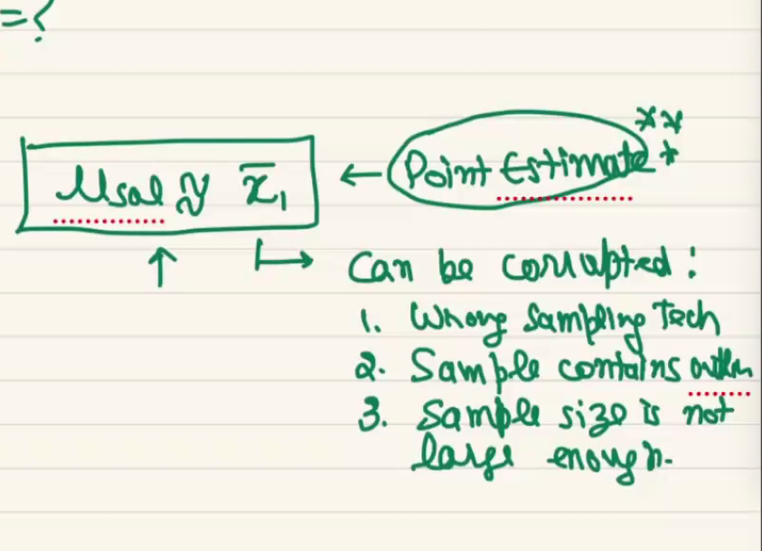


### Unsupervised Learning Algorithm
#### 1. Clustring
1. k-mean
1. k-mean+
1. H clustering: `Agglormartic clustring`
1. DB Scan(density based clustring): `also use for outliers`
1. GMM (Gaussian mixture models)
1. CDN (deep learning based clustring approch)

#### 2. Dimentationlity Reduction
1. PCA
1. t-sna
1. Probabality based approch
1. Auto encoders

#### 3. ARM Task (association rule mining Task)

#### 4. Recommandation system

#### how we will be knowing that it is a bad model.
not good answer
1. training score and test score
1. low accuracy
1. high error

goood answer
1. train score and test score
1. train accuracy and test accuracy

example : mock test vs acutal test

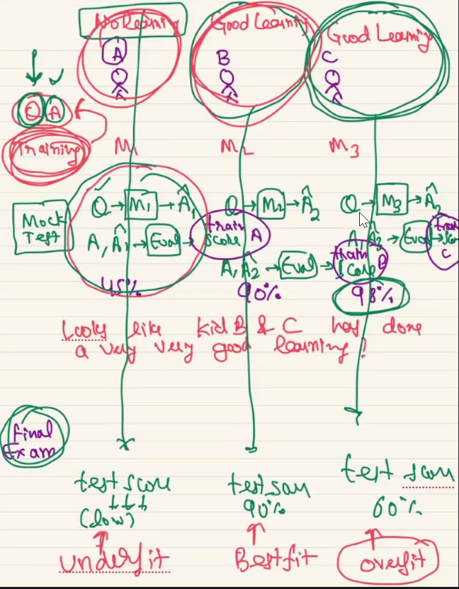

#### Q. if the model output is verybed? give me resason?
1. `Change the alogorithm`
2. `chnage the data preprocessing`

#### Q. How you determine if the model is good or bed?
1. train score and test score
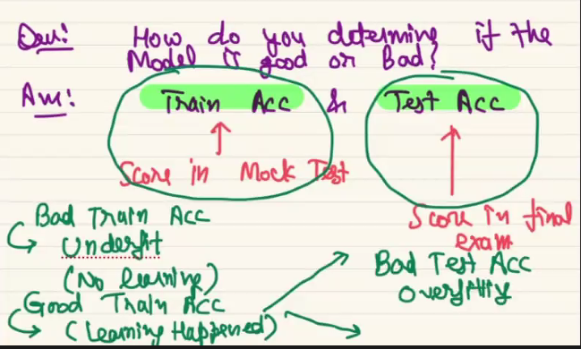
overfit- `good at training and bed at testing` <br>
underfit(no learning) - `bed on training, good on testing` <br>
best fit - `perform well in test and train`

#### Q. what to ask if a problem statement is thrown at you?
`Given a loan applicaiton predict if the application is approv or rejected` <br>
bank ask the following question
1. cibil score
1. salary
1. asset
1. 6 salary slip

note: must have `low false postive and false negative` <br>
question to bank: do you have the data
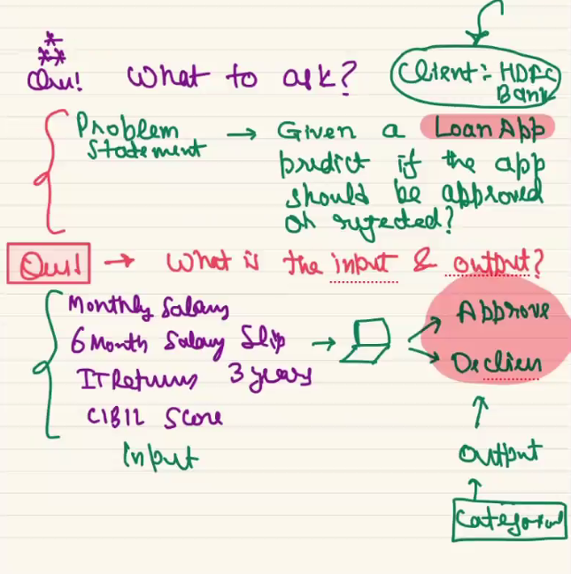

#### Q. Can you create the spam detection?
`Question should be ask like, what is the input and output`


### villion of ml model
- missing value
- outliers

### EDA helps us alot in ML:
1. help to find the outlier
1. missing value
1. insight
1. Recommandation

Agenda 
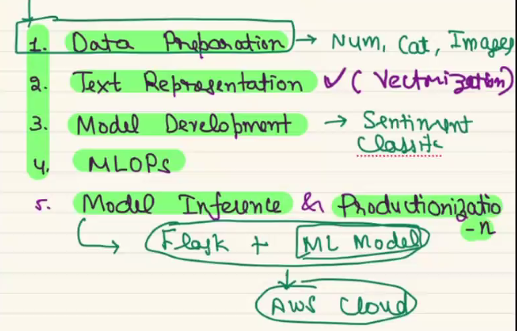

### data preperation/preprocessing
1. clean the data
1. Numerical feature extraction   
    - tfidf vectorizier ,word2vec,glove algorithm
1. One-hot encoding and label encoding
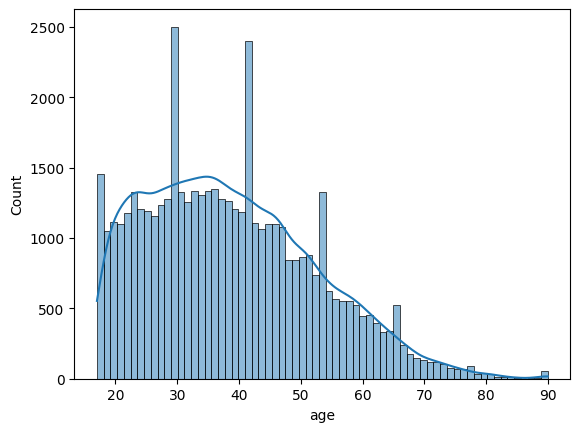

### Vectorization technique for text data
1. Bow
2. Tf-idf
3. Word2vic
4. Glove
5. Fast Text
6. RNN/LSTM/GRUs (it do the preprocessing automatically)
7. ELM
8. Transformer (LLM) 
    - ChatGPT(T for Transformers)
    - Bert(T for Transformers)


Note: PCA need scaling to give the data

#### if the y is categorica we can not evalute model using 
1. RMSE, R2
1. ACC, Confusion Metrix, f1 score,  recall, precision

#### how to start with project when you get the data
1. indentify the input and output
    - find the classifiction or regression problem
    - find suitable algothrim for you data
2. split the data
3. data preprocessing on train data
4. data preprocessing on test data
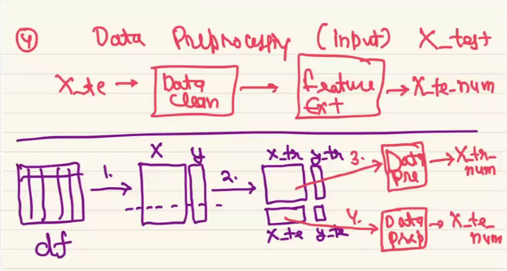
5. Model building on train data
6. Evaluate on train data(mock test)
    - if train score is very low then then change the algo or preprocess the data
    - either algo or data preprocessing have the problem
7. Evaluation on test data(final data)
8. use evaluation metrices 
    - if the problem is regession- use the regession evalution metrics
    - for example- RMSE, R2
    - if the problem is classificion- use the classificition evalution metrics
    - for example, acc, f1-score, precesion, 
    - sklearn, evaluation metrics
    - tensorflow- evaluation metrices

#### Data leakage
1. split the data the first then do the preprocessing
1. the algorithm should never look at data
1. so data leakage will always lead to overfitting

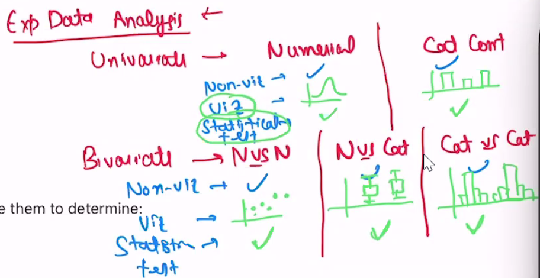

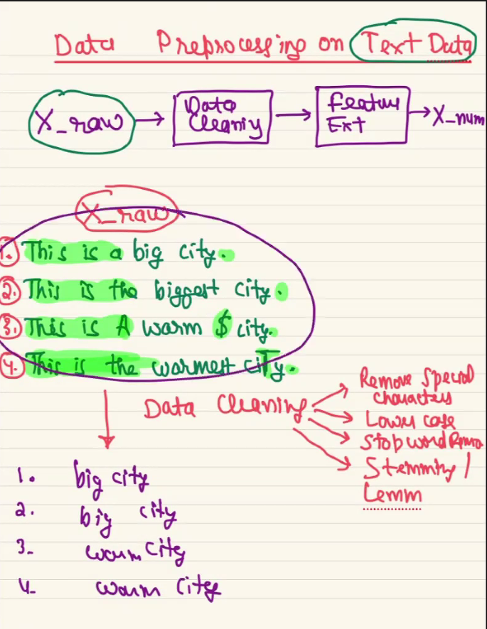

### BOW
- vectrization if feature extraction 
- don't have sequence
- Glove and Word2Vec has capacity of handle the seuqence
- Q. where is apply which vectorization method
Vectrization- taking the data in text format and convrting to numerical value
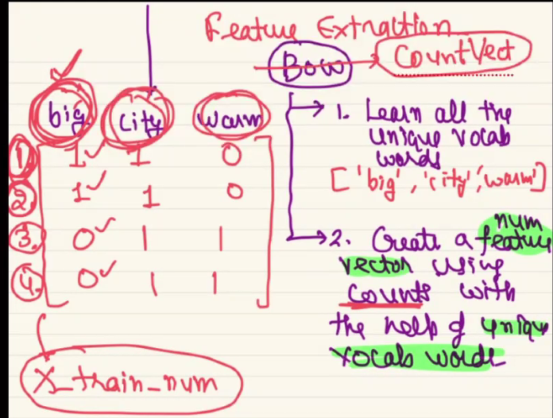

### Coming up
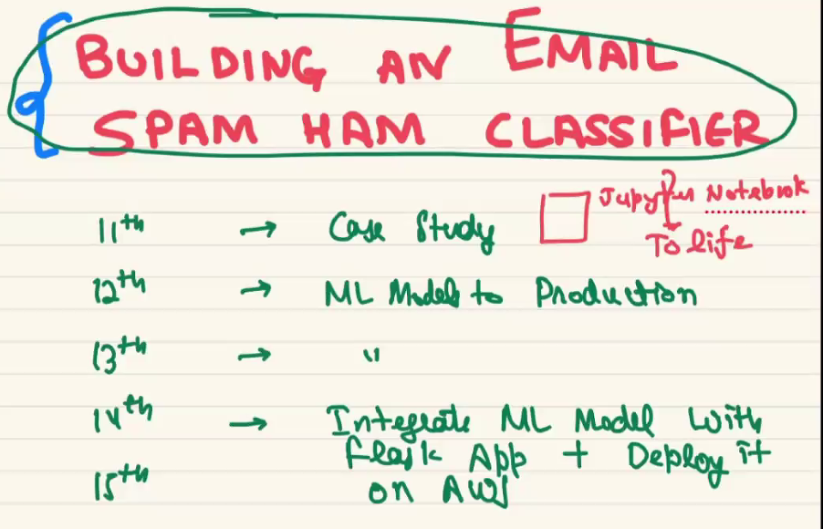

# MLops
https://github.com/bansalkanav/Machine_Learning_and_Deep_Learning/tree/master/Module%205%20-%20MLOPs
### Build an email spam Ham classifier
Q. Question that we should ask when we get the ML task
A. What is input and Output

Step 1: `Input/output`find out what type of task.
   * identify x & y for given dataframe
Step 2: `Split data into train and test`
Step 3: `Data Preprocessing on training data`: clearn the data
Step 4: `Data Preprocessing on test data`: clearn the data
Step 5: `Feature extraction On training data`
   * BOW - fail because of sparse matrix(use PCA, to cvt to dense)
   * TF-if - fail because of sparse matrix(use PCA, to cvt to dense)
   * Glove
   * BERT
Step 6: `Feature extraction On test data`
Step 7: `Model selection and Building`: choose correct algorithm for you task
   * KNN
   * DT
   * Random Forest 
   * SVM
Step 8: `Train the model using train data`
Step 9: `Evaluate the model using text data`: since it is classifiction problem we will choose
   * Accuracy
   * F1-Score
   * Precision
   * Recall
Step 10: `Hyperparameter tuning`: use to improve the model accuracy
Step 11: `Pipeline Creation`: STep by step process
   * help Optimze the hyperparmeters tuning workflow

Notebook link: https://github.com/bansalkanav/Machine_Learning_and_Deep_Learning/blob/master/Module%205%20-%20MLOPs/1.%20Model%20Serialization%20and%20Deserialization/2.%20Text%20Classification/document_classification.ipynb