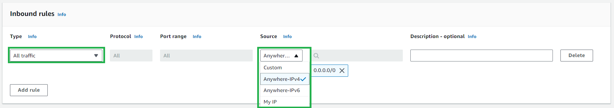
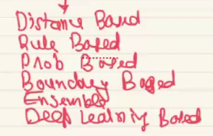
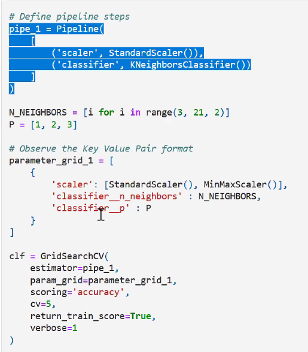
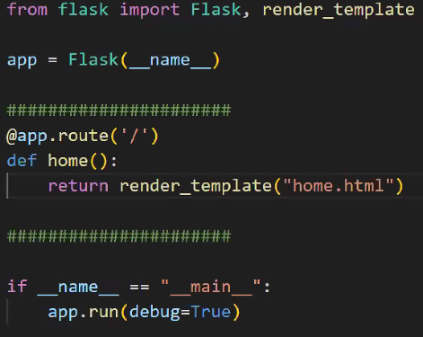
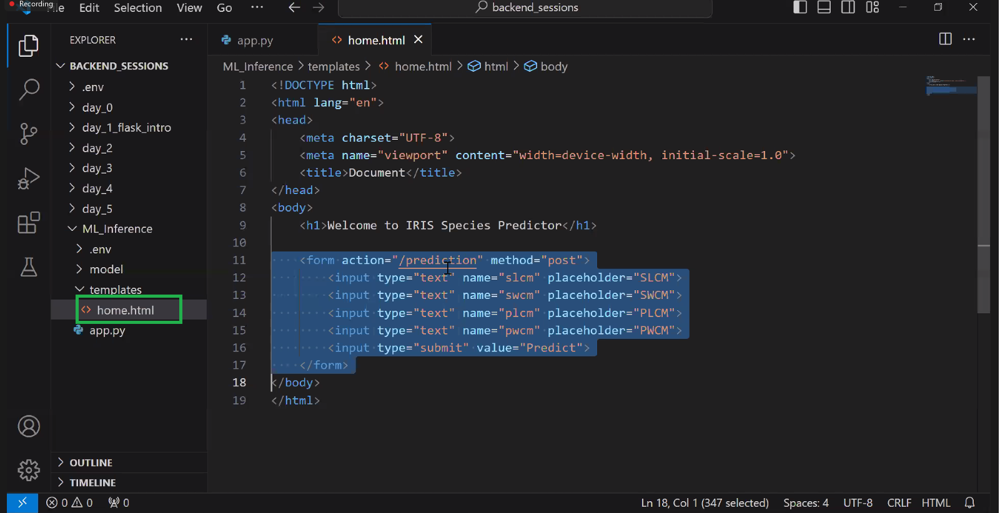
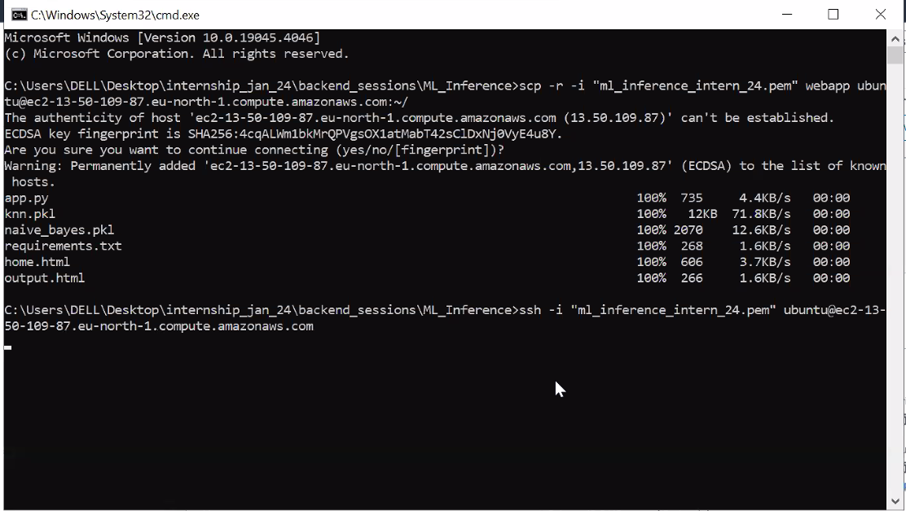
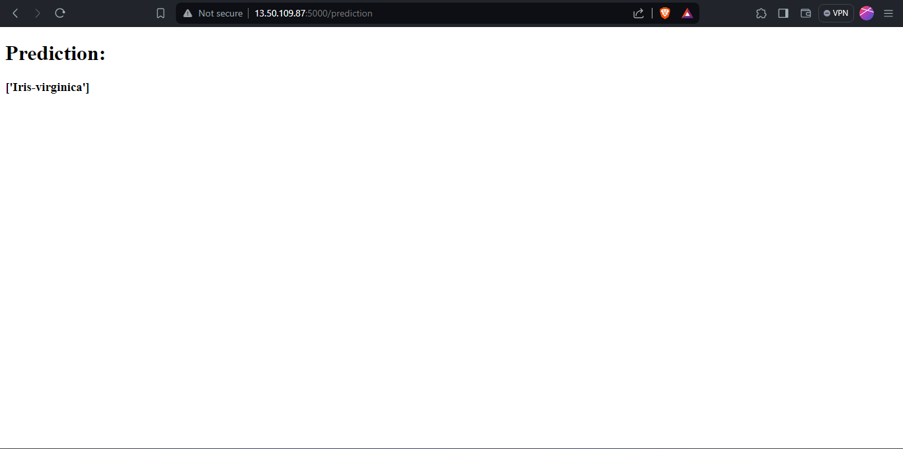

# Data-Scientist-Intern

## Agenda (12-02-2024)
1. KNN Imputation
2. Feature important using decision tree
3. Regulization also help us to understand feature important.

4. Hadoop
   + HFES - use to store the data in multiple partation
   + Map Reduce - help you to Process the data
   
#### Spark
+ Spark - new way to process data is spark not map reduce
+ Spark - also help us to analyse the data
+ best (HDFS + Spark)
+ HDFS - HDFS is use to store the large data
+ SparkSQL 
+ MLlibs for spark(similar to sklearn library)
+ Spark Streaming
+ you can apply spark on (csv, json, etc)

__Important notes__
 1. train and text score is used to find the overfitting and underfitting.
 2. if data become very big or data are in different places then doing with the pandas will be very difficult.

### Data Enginerring


#### HDFS
to take out the data from HDFS we need to use
- Apache SQOOP
- Apache Fluma
 
DA, ML, DL, NLP, CV, LLM
Spark
Cloud

#### from where data can be generated
1. IOT sensor
1. Google Form
1. Web Scrapping
1. more...

#### How to analyse and handle the big data
1. Map Reduce
2. Apache Spark

#### How to extract the data from HDFS
1. ApacheSQOOP
2. Apache Flume

#### Data Warehouse
1. AWS Redshift
1. Snowflack

#### dependence management(orchastrating)
1. Apache Airflow

#### Tools to take out data from data warehouse
1. SQL

Date - 13-02-2024
## Advance Stats DA
1. __Descriptive Stats__
   def : help us to describe the historial data.
   - Allow us to build reports(Summary of data)
   - Visulization
   - help to build Visual Dashboard
   - enemy: missing value, outliers

2. __Infrential Stats__
   - Estimation, appoximation
   Q. need of estimation and approximating something
   + A. Data collection is very expensive so we estimate the data
   + example 1: What is avg age of an indian citizen?(pandas, spark can easly find the mean)
   + example 2: total population of india just an estimate. 
   becz counting all people is very difficult

### Population 
   - collection of data
   - example- age of all the indian citizen

### sampling
- what is good sample?
   + low bias, random, varity.
- 
- subset of population, which represent the entire population.
- if you don't have enough money to collect the data we do sampling.
- we randomly collecting the data.
- it is not possible to collect the data of 1.4 billion of data, it is depend upon the budget of the company.

Q. what is the avg salary of the population?
Q. what is the avg age of the populaiton?
- do a data collection at very small scale becz
   + time consuming
   + collecting data is very expensive.

### Good Sampling Techinque
   1. **Uniform random sampling**:
      + it is randomly picking data points, giving equal chance to each and every data points.
      + in  case of salary, bias will come because of outliers.(there is sampling bias)

### Estimate can be corrupted:
1. wrong sampling techinque
1. sample contains outliers
1. sample size is not large enought

### samples mean

step to computer
1. pick 'm' sample of size 'n'
2. computer avg of each samples
3. we will end up getting, sampling distribution of samples mean.

### Estimation
- **1. Point estimation** - not so good 
- **2. Central limit theorum** is use to estimate, or make better inference/apporximation/estimation on the entire population using a small random sample.

### central limit theorum
   + find out point estimation of multiple
    sample
   + We take differnt samples from population and find out the average.
### Conculsion of central limit theorum
- more the data better is the estimate
- x-bar follow normal distribution.
- sampling distiributiion average is approxtly similar to mean of the population
- Normal distribution with mean and standard deviation
- samples mean(X) = poplulaiton mean
- 

> Sampling distributin follow the Normal distribution/Gaussain, there are 3 observation, learn it.

> Q. What is the avg height of gorilla? <br> 
ans - take sample and find it average

### to make sure if the data is follow normal discribution.

- we can tranform the any distribution to the normal distribution using

### Implement CLT on this data using python
```python
sns.histplot(population_df['age'], kde=True)
print('Number of rows: ', population_df.shape[0])
print('Population Mean: ', population_df['age'].mean())
```


```python
def sampling_distribution(data, sample_size, number_of_sample):
    sample_means = []
    for m in range(number_of_sample):
        sample = data.sample(n=sample_size)
        sample_means.append((sample_size, sample.mean()))
    sampling_distribution_df = pd.DataFrame(sample_means, columns=['n', 'mean'])

    print("*"*20, " R E P O R T ", "*"*20)
    print("Mean Check")
    print("Sampling Distribution Mean:", sampling_distribution_df["mean"].mean())
    print("Population Mean: ", data.mean())

    print()
    print("Standard Deviation Check")
    print("Sampling Distribution Std:", sampling_distribution_df["mean"].std())
    print("Population Std / (sample_size)**0.5:", data.std()/np.sqrt(sample_size))

    print("*"*55)
    
    return sampling_distribution_df
```

```python
def sampling_distribution_plot(data):
   fig, axes = plt.subplots(1, 2, figsize=(8, 3), constrained_layout=True)
   
   axes[0].set_title("Sampling Distribution")  # Add a title to the axes
   axes[0].set_xlabel('Mean')  # Add an x-label to the axes
   axes[0].set_ylabel('Density')  # Add a y-label to the axes

   sns.histplot(data, kde=True, ax=axes[0])
   
   stats.probplot(data, dist=stats.norm, plot=axes[1])
   axes[1].grid()
   
   plt.show()
```

```python
n=50
m=100

sampling_distribution_df = sampling_distribution(data=population_df['age'], sample_size=n, number_of_sample=m)

sampling_distribution_plot(data=sampling_distribution_df["mean"])
```


### Statistical Test in Python

link - https://github.com/bansalkanav/Machine_Learning_and_Deep_Learning/blob/master/Module%203%20-%20Advance%20Data%20Analysis%20and%20Statistics/6.%20Performing%20Statistical%20Test/statistical_test_practical_implementation.ipynb
Important Hypothesis Tests
There are many hypothesis tests. Here is a list of few most important tests:

### Univariate
- **Chi-Square Goodness-of-Fit Test**(cat): Tests whether the observed frequencies of categorical data match the expected frequencies according to a specified distribution. (univariant cat feature)
- **Shapiro-Wilk Test**(Numerical Continues): The Shapiro-Wilk test is a statistical test that checks whether a dataset follows a normal distribution.(less then 5000 data points, univ num continus feature)
-**Kolmogorov-Smirnov Test**: Tests whether a sample comes from a specific distribution (not limited to normal distribution). It can be used to compare any two continuous distributions.
One-Sample t-test: Tests whether the mean of a single sample is significantly different from a known or hypothesized population mean.

### Bivariate
- **Pearson Test**: Tests whether two samples have a linear relationship.(num-num), it show probabality linear relationship exist. Spearman's Rank Correlation (Alternative for Pearson Test)
- **Two-Sample t-test**: Compares the means of two related samples (e.g., before and after treatment) to determine if there is a significant difference.(cat-num, for 2 cardinate(height vs gender)) Mann-Whitney U Test (Wilcoxon Rank-Sum Test) (Alternative for 2-sample t-test)
- **ANOVA (one_way_anova)**: Compares the mean of three or more samples. It helps determine if there is a significant difference between the samples.(more then 2 cardinate(feature), Cat-num). Kruskal-Wallis Test (Alternative for One-Way ANOVA Test)
- **Chi-Square Test of Independence**: Tests whether there is a significant association between two categorical variables in a contingency table.(cat-cat) what kind of relationship is there?
(can apply on gender and count of gender)


# Web Application Development


### Client Server Architecture/ Request Respose Architecture


### DNS Server
```
find out the address of the server, using url.
DNS know store all the website address.
it is like phone book directly, which contain, url and IP Address associated with it.
```

### what is server?
```
It is a computer, that can serve multiple request at a time.
It has RAM, MEMORY, and CPU.
```

### what is the difference between in client machine and server machine?
```
Server Machine is faster then our personal computer(client machine).
Bigger CPU, Bigger RAM, Bigger Processing, so these server product lot of heat
```

### help us to build Application server:
- Flask, Django, FastAPI using python

### help us to build Web page
- HTML, CSS, JS


- FTP: send file, data
- SFTP: send large data
- SMTP: send email
- HTTP: text tranfer protocall, transfering the text, not secure
- HTTPs: send text file securly
in order to communicate and send  data you need one of the protocal.


### Response-Status Code


### How to make request uisng Python


### Create our own server(Apllication server & DB)


### create virtual environment
1. __Create__ : python -m venv .env_flask_day_2 
2. __activate__ : .env_flask_day_2\Scripts\activate
3. __Check all dependency__ : pip list
4. __install Dependency__ : Flask, Pandas, Numpy, Matplotlib 
5. __deactivate__ : .env_flask_day_2\Scripts\deactivate

### Flask
```python
# this is application program
from flask import Flask
app = Flask(__name__) #intilize the flask object

# by default get request
@app.route('/', methods=['Post']) #crate a route/endpoint and bind to some function
def index():
    return "Welcome to this application"

@app.route('/about')
def about():
    return "This is about Page"

if __name__ == '__main__':
    app.run()
```

#### Get Resquest

### Sending Varible data between client and server
- 127.0.0.1:5000/add?a=6&b=10
- capture the varible from url and send it to endpoint bind function.

```python
from flask import Flask, request

@app.route('/magic')
def add_fun():
   var_1 = int(request.args.get('a'))
   var_2 = int(request.args.get('b'))
   return str(var_1+var_2)
```

### Send HTML instade of string
```python
from flask import Flask, render_template
app = Flask(__name__) #intilize the flask object

@app.route('/') #crate a route/endpoint and bind to some function
def index():
    return render_template("home_page.html")
```

### HTML
```
- HTML is not a programming language.
- define a way of formating & structuring content.
- Two type of HTML Tag
   - Self-closing tage
   - Tags with closing tags
- HTML start with Doctype
- Tag having Attributes:
   + Input Attributes: help the client to take user input
      <input type = " ">
         1. Button
         2. Text
         3. Date
         4. Email
         5. Number
         6. more...
```


```html
<!DOCTYPE html/
<html lang="en">
<head>
    <meta charset="UTF-8">
    <meta name="viewport" content="width=device-width, initial-scale=1.0">
    <title>Document</title>
</head>
<body>
    <p> Welcome to the home page. hope to see you again very soon.</p>
</body>
</html>
```

form tage help us to send data from client to server.
form tag attributes:
   1. Action: action to performed when click be performed.
   2. Method: Post, help to secure the email, & password.

```html
<!DOCTYPE html>
<html lang="en">
<head>
    <meta charset="UTF-8">
    <meta name="viewport" content="width=device-width, initial-scale=1.0">
    <title>Document</title>
</head>
<body>
    <h1> Welcome to the home page.</h1>
    <p>hope to see you again very soon.</p>

   <!-- Data hidden in this request, do not send data using get method because it is hightly insecure, use Post to send the data-->
    <form action="/magic">
        <input type="text" name="a"> <br>
        <input type="text" name="b">
        <input type="submit">
    </form>
    
</body>
</html>
```

### API for calculator
```html
<form action="/magic" method="get">
      <input type="text" name="a" placeholder="Enter First Number"> <br> <br>
      <input type="text" name="b" placeholder="Enter Second Number" > <br> <br>
      <input type="submit" value="Add">
   </form>
```

```python
@app.route('/calculator', methods=['get'])
def cal():
    return render_template("input_page.html")

@app.route('/magic', methods=['get'])
def add_fun():
    var_1 = int(request.args.get('a'))
    var_2 = int(request.args.get('b'))
    sum = var_1 + var_2
    return str(sum)
```

### API for Login
```html
<form action="/save_login" method="POST">
        <input type="email" name="email" placeholder="Enter Email"> <br> <br> 
        <input type="password" name="password" placeholder="Enter password"> <br> <br>
        <input type="submit" value="Login">
   </form>
```

```python
@app.route('/login')
def log():
    return render_template("login.html")

@app.route('/save_login', methods=['POST'])
def save_cred():
    email = request.form.get('email')
    password = request.form.get('password')
    cred = email+" "+password
    return cred
```

### if else condition on HTML
```html

    <h1>Thanks for registering {{ uname}}</h1>

    <h1>Please go home kid</h1>

```
### for loop on HTML
```html
<ul>
    
        <li>{{ note }}</li>
    
    </ul>
```

### Create dynamic route
```python
@app.route("/in/<user_name>)
def user_profile(user_name):
    return rander_templates("thankyou.html", uname=user_name)
```
# AWS Cloud
### How to create an app?
step-by-step
 1. install python
 1. create a venv
 1. download & install all the project dependency
    - pip install -r requirment.txt
 1. crate a python project
 1. run & test the project
    * python app.py
    - run on localhost
    - run on local area net
 1. deploy the application on AWS 

### Step to deploy on AWS:
1. AWS --> Crate an account
1. Rent a server(EC2) --> Configration(RAM, Storage, CPU, OS)
    * based on the configration you will get the bill/price
    * example: 1bhk vs 3bhk price
    * not EBS(Paas)
1. Transfer the project from local to AWS server
    * `SCP - Secure copy protocol`
1. configure the server:
    `remotly access the computer using SSH(secure shell).`
    1. install python
    1. install depedencies
    1. Run the applicaton


Soluction: Rent a server
example: opening a pizza store at start
Cloud service:
- Virtual for us and physical for them
1. Amazon(AWS) --> services, EC2(Iaas), EBS(Paas)
1. Google(GCP)
1. Microsoft(Azure)

They provide service in 3 format
1. SAAS(software as an service) --> Google Docs, Colab, Drive
2. IAAS(interface as an service) --> AWS EC2
3. PAAS(platform as an service) --> AWS EBS

EBS vs EC2


revanth christober


## Create AWS EC2 Instance
Step 1: Launch an Instance


Step 2: Name and tags


Step 3: Select OS images


Step 4: instance type


Step 5: key pair; to connect to our local system we need some key. connection type `SCP`, `SSH`.
`create public private key`


Step 6: Click on Launch Instance


Step 7: EC2 instace created


Step 8: go to instance
 <br>
 <br>
 <br>

Step 9: Secure the server, lot of people are comming to my server, and we are allow the person who is coming to my server. 





Step 10: Add this `anywhere` secuity groups on my network interface.


Different services of AWS
1. **Amazon SageMaker**: it is used to build, train and deploy mechine learning models.
2. **s3**- storage in clound
3. **RDS** - Managed Relational Database Service
4. **RedShift** - Fast, simple, cost-effective Data Warehousing.
5. **Athena** - Serverless interactive analytics service, all you EDA everything done on athena instead of using you systems
6. **EC2**- we are learning this

## Hosting the web app on AWS
Step 1: Connect to instance

/
Step2: Go to app folder and start `CMD`

/
Step 3: `SSH` - use the key and enter into server <br>
`SSH -i 'key' REMOTE_SERVER`


step 4: copy all templates and app file to single folder.


step 5: create dependecy text file


Step 6: Transfer the templates and app. `SCP`: secure copy using key. `no need of transfering 'env' and 'key'` <br>
`scp -r -i 'key' REMOTE-SERVER:~/`

__cmd:__ `scp -r -i "flask_deployment_jan_internship_24.pem" webapp ubuntu@ec2-3-83-244-219.compute-1.amazonaws.com:~/`


Step 7 : Login to server and verify the copying. <br>
__cmd__: `ssh -i "flask_deployment_jan_internship_24_key.pem" ubuntu@ec2-3-83-244-219.compute-1.amazonaws.com`


Step 8: Update OS and install dependency 
1. `sudo apt update`: download all package
2. `sudo apt upgrade`: install all package
3. `sudo apt install python3`: install python3
4. `sudo apt install python3-pip`: install pip
5. `pip install -r requirement.txt`: install dependency

step 9: Run and test the application
`Broadcast application`
1. fix code 
    ```python
    app.run(host='0.0.0.0', port=5000)
    ```
2. go to instance and find public ip:

3. run the program in the background
no hang-up: 
    - `python3 app.py` : hang-up
    - `nohup python3 app.py &` : provide terminal use
    - `nohup python3 app.py` <br>
4. to see the running program `top -u $USER`
5. stop the running program
kill <Process ID(PID)>: 
    - `kill 1377` nomally kill 
    - `kill -9 1377` forcefully kill


# Machine Learning
`mathematical representation of a relationship between between input and output` 


Agenda <br>
`1. Overview` <br>
`2. Data Preparation` <br>
`3. Building a model` <br>
`4. Evaluation ` <br>
`5. more ..`

#### Pattern
`Mathematical relationship between input and output`
#### What is Machine learning?
`Algothrim map the relationship between input and output`

Q. if it is fail to map relationship between the x and y then what happen?
A. if the model is not gernerating better prediction then either data has problem or algorithm has problem.


#### We can not say whatever our model is prediction is not 100% correct.
`that is why we need to 'evaluation' the model `

### Supervised Learning Algorithm
#### 1. Regression Problem
1. Linear Regression
1. SVM

#### 2. Classification Problem
1. Logistic Regression
1. SVM




### Unsupervised Learning Algorithm
#### 1. Clustring
1. k-mean
1. k-mean+
1. H clustering: `Agglormartic clustring`
1. DB Scan(density based clustring): `also use for outliers`
1. GMM (Gaussian mixture models)
1. CDN (deep learning based clustring approch)

#### 2. Dimentationlity Reduction
1. PCA
1. t-sna
1. Probabality based approch
1. Auto encoders

#### 3. ARM Task (association rule mining Task)

#### 4. Recommandation system

#### how we will be knowing that it is a bad model.
not good answer
1. training score and test score 
1. low accuracy
1. high error

goood answer
1. train score and test score
1. train accuracy and test accuracy

example : mock test vs acutal test


#### Q. if the model output is verybed? give me resason?
1. `Change the alogorithm`
2. `chnage the data preprocessing`

#### Q. How you determine if the model is good or bed?
1. train score and test score

overfit- `good at training and bed at testing` <br>
underfit(no learning) - `bed on training, good on testing` <br>
best fit - `perform well in test and train`

#### Q. what to ask if a problem statement is thrown at you?
`Given a loan applicaiton predict if the application is approv or rejected` <br>
bank ask the following question
1. cibil score
1. salary
1. asset
1. 6 salary slip

note: must have `low false postive and false negative` <br>
question to bank: do you have the data


#### Q. Can you create the spam detection?
`Question should be ask like, what is the input and output`


### villion of ml model
- missing value
- outliers

### EDA helps us alot in ML:
1. help to find the outlier
1. missing value
1. insight
1. Recommandation

Agenda 


### data preperation/preprocessing
1. clean the data
1. Numerical feature extraction   
    - tfidf vectorizier ,word2vec,glove algorithm
1. One-hot encoding and label encoding


### Vectorization technique for text data
1. Bow
2. Tf-idf
3. Word2vic
4. Glove
5. Fast Text
6. RNN/LSTM/GRUs (it do the preprocessing automatically)
7. ELM
8. Transformer (LLM) 
    - ChatGPT(T for Transformers)
    - Bert(T for Transformers)


Note: PCA need scaling to give the data

#### if the y is categorica we can not evalute model using 
1. RMSE, R2
1. ACC, Confusion Metrix, f1 score,  recall, precision

#### how to start with project when you get the data
1. indentify the input and output
    - find the classifiction or regression problem
    - find suitable algothrim for you data
2. split the data
3. data preprocessing on train data
4. data preprocessing on test data

5. Model building on train data
6. Evaluate on train data(mock test)
    - if train score is very low then then change the algo or preprocess the data
    - either algo or data preprocessing have the problem
7. Evaluation on test data(final data)
8. use evaluation metrices 
    - if the problem is regession- use the regession evalution metrics
    - for example- RMSE, R2
    - if the problem is classificion- use the classificition evalution metrics
    - for example, acc, f1-score, precesion, 
    - sklearn, evaluation metrics
    - tensorflow- evaluation metrices

#### Data leakage
1. split the data the first then do the preprocessing
1. the algorithm should never look at data
1. so data leakage will always lead to overfitting


### BOW
- vectrization if feature extraction 
- don't have sequence
- Glove and Word2Vec has capacity of handle the seuqence
- Q. where is apply which vectorization method
Vectrization- taking the data in text format and convrting to numerical value


### Coming up


# MLops
https://github.com/bansalkanav/Machine_Learning_and_Deep_Learning/tree/master/Module%205%20-%20MLOPs
### Build an email spam Ham classifier
Q. Question that we should ask when we get the ML task
A. What is input and Output

Step 1: `Input/output`find out what type of task.
   * identify x & y for given dataframe
Step 2: `Split data into train and test`
Step 3: `Data Preprocessing on training data`: clearn the data
Step 4: `Data Preprocessing on test data`: clearn the data
Step 5: `Feature extraction On training data`
   * BOW - fail because of sparse matrix(use PCA, to cvt to dense)
   * TF-if - fail because of sparse matrix(use PCA, to cvt to dense)
   * Glove
   * BERT
Step 6: `Feature extraction On test data`
Step 7: `Model selection and Building`: choose correct algorithm for you task
   * KNN
   * DT
   * Random Forest 
   * SVM
Step 8: `Train the model using train data`
Step 9: `Evaluate the model using text data`: since it is classifiction problem we will choose
   * Accuracy
   * F1-Score
   * Precision
   * Recall
Step 10: `Hyperparameter tuning`: use to improve the model accuracy
Step 11: `Pipeline Creation`: STep by step process
   * help Optimze the hyperparmeters tuning workflow

Notebook link: https://github.com/bansalkanav/Machine_Learning_and_Deep_Learning/blob/master/Module%205%20-%20MLOPs/1.%20Model%20Serialization%20and%20Deserialization/2.%20Text%20Classification/document_classification.ipynb

## Hyperparameter Tunning

K-fold
1. Grid search CV
1. Randomize search cv
`Gives multiple model based on multiple configration of same algorith` <br>
- best model can be consider if it gives me best score for both training and testing.

Amount this model which model you will choose if all the model are giving same accuracy metric

Decision based on 

- 1. Training Time
- 2. Model Size
- 3. Prediction time - `people don't wanted to wait 10m for the output`

Q. What to do if a time is less in one algo and another one consumes less space what to do then? <br>
`But these considerations will only come into picture provided all the models got after hyperparameter tuning have similar train-test scores, if they don't can we simply prioritize train-test scores?`<br>
`it depends on the reqs of organisation whether they want to priritise speed or storage, need to find a balance`

## Machine Learning Pipeline



* if we don't use this pipeline then i will be very bulky and we have to create more then 1000 model with different configration.
```python
pipelines = {
    'knn' : Pipeline([
        ('scaler', StandardScaler()),
        ('classifier', KNeighborsClassifier())
    ]), 
    'svc' : Pipeline([
        ('scaler', StandardScaler()),
        ('classifier', SVC())
    ]),
    'logistic_regression': Pipeline([
        ('scaler', StandardScaler()),
        ('classifier', LogisticRegression())
    ]),
    'random_forest': Pipeline([
        ('scaler', StandardScaler()),
        ('classifier', RandomForestClassifier())
    ]),
    'decision_tree': Pipeline([
        ('scaler', StandardScaler()),
        ('classifier', DecisionTreeClassifier())
    ]),
    'naive_bayes': Pipeline([
        ('scaler', StandardScaler()),
        ('classifier', GaussianNB())
    ])
}

# Define parameter grid for each algorithm
param_grids = {
    'knn': [
        {
            'scaler': [StandardScaler(), MinMaxScaler()],
            'classifier__n_neighbors' : [i for i in range(3, 21, 2)], 
            'classifier__p' : [1, 2, 3]
        }
    ],
    'svc': [
        {
            'scaler': [StandardScaler(), MinMaxScaler()],
            'classifier__kernel' : ['rbf'], 
            'classifier__C' : [0.1, 0.01, 1, 10, 100]
        }, 
        {
            'scaler': [StandardScaler(), MinMaxScaler()],
            'classifier__kernel' : ['poly'], 
            'classifier__degree' : [2, 3, 4, 5], 
            'classifier__C' : [0.1, 0.01, 1, 10, 100]
        }, 
        {
            'scaler': [StandardScaler(), MinMaxScaler()],
            'classifier__kernel' : ['linear'], 
            'classifier__C' : [0.1, 0.01, 1, 10, 100]
        }
    ],
    'logistic_regression': [
        {
            'scaler': [StandardScaler(), MinMaxScaler()],
            'classifier__C': [0.1, 1, 10], 
            'classifier__penalty': ['l2']
        }, 
        {
            'scaler': [StandardScaler(), MinMaxScaler()],
            'classifier__C': [0.1, 1, 10], 
            'classifier__penalty': ['l1'], 
            'classifier__solver': ['liblinear']
        }, 
        {
            'scaler': [StandardScaler(), MinMaxScaler()],
            'classifier__C': [0.1, 1, 10], 
            'classifier__penalty': ['elasticnet'], 
            'classifier__l1_ratio': [0.4, 0.5, 0.6],
            'classifier__solver': ['saga']
        }
    ],
    'random_forest': [
        {
            'scaler': [StandardScaler(), MinMaxScaler()],
            'classifier__n_estimators': [50, 100, 200]
        }
    ],
    'decision_tree': [
        {
            'scaler': [StandardScaler(), MinMaxScaler()],
            'classifier__max_depth': [None, 5, 10]
        }
    ],
    'naive_bayes': [
        {
            'scaler': [StandardScaler(), MinMaxScaler()]
        }
    ]
}

# Perform GridSearchCV for each algorithm
best_models = {}

for algo in pipelines.keys():
    print("*"*10, algo, "*"*10)
    grid_search = GridSearchCV(estimator=pipelines[algo], 
                               param_grid=param_grids[algo], 
                               cv=5, 
                               scoring='accuracy', 
                               return_train_score=True,
                               verbose=1
                              )
    
    %time grid_search.fit(X_train, y_train)
    
    best_models[algo] = grid_search.best_estimator_
    
    print('Score on Test Data: ', grid_search.score(X_test, y_test))
```

## Serialization and Deserialization

1. Serialization(joblib) - use to save the model
```python
# Serialization
best_model = clf.best_estimator_
joblib.dump(best_model, 'best_models/demo_model_knn.pkl')
```
2. Deserialization - use to make model ready for production
```python
# Deserialization
model = joblib.load('best_models/demo_model_knn.pkl')
new_data = np.array([[5.1, 3.0, 1.1, 0.1]])
prediction = model.predict(new_data)
print("Prediction:", prediction)
```

## Caching and memoisation
- help to reduce the training time
- 10min to 3sec360

## What to do if our model give bad score
1. Hyperparameter tunning
2. Change the algo
3. change the preprocessing

## AI/ML code motive
1. not reuseable
1. not scable

## create the API for IRIS flower prediction
1. Create vene
2. activate the env
3. install dependency

Basic configration <br>

* show home page
 

* `to migrate the data from frontend to backend use form`



* `AWS`: put entire things in production  

* output



## MLflow library
* Create the database and

# Step to solve any NLP problem

* 1. Identify the input and output
* 2. Train and Test Split
* 3. Initalize a pipeline
* 4. Initialize the config/hyperparameter grid
* 5. Apply Grid SearchCV(k-fold)

## Experiment Tracking
- we have use the pipeline and club to hyperparameter and automation of work flow.

### Tools for experiment tracking
- `MLflow` - maintaining a track of all the experiments which you are running.
- manage and reproduce the previous experiment
### what can we do with mlflow?
these are the 2 things that mlflow is important
1. experiment tracking
2. model management

why experiment teacking?
1. Organisation/manage
1. Reproduce previously done experiment
1. OPtimize

problem
* To keeping track of experiment data <br>

`Q. why to track experiment?`

`Q. is mlflow only help in experiment tracking only?`
Ans. No

`Q. is mlflow apply during production or during development?`<br>
A. During developmnet

`Q. What else you will track?`
* train time
* size of model
* pred time


### Termonlogyes for MLflow
1. `Experiment Run`:
    1. `Meta-Data`: All the info(which algo was used, which hyperparamet, what was the train time, what was the pred time) to run the experiment
        *
    1. `Artifact`: outcome for an experiment run
#### Q. If we have best model why we are consern about all the model?

## MLflow
- using mlflow i'm optimizing work flow
- it is available as library
- it has user interface

`Pipeline help use to automate the workflow.`

### Install MLflow to windows.
Step 1: `Go to Anaconda Prompt`  <br>
Step 2: `conda install mlflow`  <br>
Step 3: `mlflow ui` or `mlflow server --host 127.0.0.1 --port 8080` <br>
Step 4: `http://127.0.0.1:5000`  <br>

Step 5: `import mlflow`
* `mlflow.set_experiment("iris_species_experiment")`

Step 6: 

Step 7: `All 54 possible outcomes`


Step 8: run another code


Step 9: more info


Step 10: Rename


## Machine Learning piplelline Orchestration
* `Orchestration: how to manage the workflow is called orchestration` <br>
* `prefect: Tool to manage the work, or pipeline management` 
* suppose there is error comming in data load, or during data spliting, if we proper manage the task.
* we can automats and schedule the task.
* it is avaible as library and it also have ui.

## Introducing prefect
* Prefect is an open-source orchestration and observability plateform that devloper to build and scale resilient code quickly, turning their python scripts into resilient, recurring workflows.

## Why prefect
1. key competitor: Airflow, it is data pipline, used by data engineer.
1. help us to manage and scheduling the machine learning workflow.
1. Gives observabilty into failures
1. if computationly very help, it provide the `native dask framework; it is for paraller computation`. if our ml task is very heavy

### Step us prefect
1. `python -m venv .env` - Create virtual env
1. active the env
1. `pip install prefect` or `pip install -U prefect` or `pip install prefect==2.4`
1. `prefect version`
1. `prefect server start` 
1. go to`http://127.0.0.1:4200`


# LLM - Large Language Model
## Introduction to search engines
Search Engines : 
1. __Google__
2. __Bing__
3. __DuckDuckGo__
4. __YouTube__: Relevant Videos
5. __LinkedIn__: Relevant profile, Job, Post/Article
6. __NetFlix__: provide you relevant Movies, Series, Documentent
7. __Bloombarg__: Relevant News

_Input_ : User's Search Query <br>
_Outcome_ : list of webpages


Match(_finding the similar documnets_) the user's search query with all the doc's in the database

`Q. How to find the similarity?` <br>
Ans - here, we are assuming distance to find the similarity between 2 points.


`Q. Do you know about similarity, what is the way to compute the similarity in computer science and mathematics?` <br>
Ans - Distance, we can find the similarity using distance. 

`Q. How to find the distance between 2 points?` <br>
1. Eucledean Distance
1. Angular Distance
1. Manhatten Distance
1. cosine Distance
1. elavantain Distance

`Q. Which data point are most similary data point in given figure?`<br>

Ans - it depends upon what distance metrics you are taking.
1. As per Eucledean, the closest data point are A and B, and hence AB are most similar.

1. As per Angular Distance and cosine Distance, the angle between AB > CB > AC. hence the most similar in this case will be AC.


`Q. Why we have these many distance metrics? In high dimentional data are we going to use euclean distance or angular distance metrics?` <br>
Ans - In `higher Dim` --> Eucledean distance will fail because of `Curse of dimenality`.
for example, In NLP problem we can not use Eucledean distance, it is recommand to use cosine distance. becuase of BOW/TF-IDF has more then 30k features.

### Use case; we have given a search query(left) and database(right).

`Q. What are we going to apply if a database is given to you?` <br>
Ans - 1. Clean the given data(lamatization or other), <br>
2. after clean data apply vectorilzation <br>

`Q. What is the database for google?` <br>
 Ans - All the available, webpage present on internet is the database for google, such as youtube, blog, articles, etc <br>

 `Q. What is the job the google has to apply in this database?` <br>
 Ans - Google has to go each and every webpage and apply some cleaning and vectorization on webpage. <br>

 `Q. After cleaning and vectorization store the vectorize data?`
 Ans - we need special vector stores databases to store high dimensional numerical representation of data.
 1. __SQL__: MySQL, Orcale, PostgresSQL, SQlite
 2. __NoSQL__: MongoDB, Redish, Casandra
 3. __Vector Store DB__: Vector Store are very powerfull to store vectorlize form of data. for example: ChromaDB(open-source free), Pine cone DB(paid)

---------------------------------
## Search Engine - Building the Frontend and Backend Component
Two main Component for this project
1. __Component 1__: Frontend, where people enter the query


2. __Component 2__: 

    1. __Keyword based serach__: in keyword based search, if we type top 10 laptop then it will only show `top 10 laptop` not the `top 10 computer`, but top 10 computer must also be the query result. because computer and laptop mean the same.
        - similar query: best laptop, best computer, highly performance laptop etc
    2. __sementic search__: the above query has the same search query, without any sementic search

#### About the data

it contain 80k to 100k subtitle files for movies and tv series, size around the 2GB

#### format of dataset

1. Stored the entire data in database file, they don't provide us in the format of .srt or zip file.
1. encode the file in latin-1 and store it into database, database contain 3 columns, unique _id_ of file, _filename_, and latin-1 encode _content_.

#### Task 1: Our first job with given database
1. our job is how to read a table from .db & decode all the files stored inside the table.
1. Do the back engineering and bring the data into .srt format. 
1. basically decode the data 

#### Task 2: Do some preprocess and clean the data
`Dialog number, timestamp, dialog`

1. remove all dialog number
1. remove all timestamp
1. Note: preserve the dialog timestamp
1. lower case
1. stopword remover
1. Stemming/Lamatization
1. create the dataframe contain, `unique id`,  `filename`, and `clean text`

#### to build a keyword based search engine we can use following verization method.
1. BOW
1. TF-IDF
and expriment amoung both the technique and find out which technique is giving best result.
note: tokenization is totally based on the what kind of vectorization we are using


#### Task 3: do the preporcess in query

1. clean the data
1. apply transformation

#### Task 4: apply cosine similarity with query and each row in the preprocess data.

It return the result of cosine, short them in decreasing order. this is example of keybased search engine because we are using here BOW, IF-IDF.

`If we use the W2V/BERT vectrization then it become sementic search engine`
`Q. what is the problem of BOW/TF-IDF?` <br>
Ans - BOW/IF-IDF has very high dimentionality, in simple term BOW/IF-IDF capture each and every keyword, but this huge dimenality come a problem also at the same time we are not preserving the meaning of the word or sementic similarity. where will i go if i wanted to preserv the meaning? it will replace it with word2vec

`Q. problem with word2vec?`<br>
word2vec create lower dimentation vecotor representation, what will happen to a very large document, do you think the context or main sence of document get lost. if our document contain 10k and it gives 300 vector represenation, do you think it lost some information the entire subtile meaning get lost if we try to capture all the information in 300 dimention. it will loss whole sence if i will caputure each and everything in 300 dimention.
- even bart and transformer have the same issue but how to solve it. 

conculsion:
for the sementic search engine, we have to use word2vec bart kind of technique. but to bart and word2vec what is the outcome, the outcome will be lower dimention may be 300 or 500 dimensional. because in Bert or word2vec the compression is going to happen. we are compressing way to much.
- `what too much compression what we will loss?`  information get loss. in a bigger documentation, a bigger subtitle file definitely the meaning or the contect or the main part of the document can get lost with that compression.
- even LSTM and RNN have the same problem of exploding gradinent or vanishing gradient
-------------------------------
### Summary
Component 2:
1. Data Clearning
2. Vectorization

Component 1:
1. Query Clean
1. Vector of query
1. similarity calculation between query vs all the docs. it is like KNN
1. Reorder the search results based on similaity score

`Q. what will be the dimenstion if we apply BOW/IF-IDF on 82k .srt data?` <br>
Ans - 
dim = 82k * d, where d is number of unique vocab words

disadvantage of BOW/TF-IDF
1. high dim
1. highly sparased
1. no semantic info preserv

advantage of w2v
1. low dim
1. Dense Representation not sparased
1. sementic info preserver, it understand computer and laptop is same.

#### Embedding
Embedding is nothing but a lower dimenation dense representation of text data. dense representation is typicallly called embedding.

#### Numerical vector
numerical vector is it can be sparse or desnse represenation. but dense represenation is typally called enbedding.

#### BOW/TF-IDF vs w2v
BOW/TF-IDF takes each word as a unique dimention. but w2v do the same, it will take each document and try to give smaller represenation a dense representation the dimenstion of these representation is very low, dimenstion low mean may be you capture less information.
`Note: BOW/TF-IDF is definitly preseve information but it comes at a cost and the cost is high dimenation and sparase represenation but in w2v it has less dimenation and you end up with lossing information.`

`Q. How do we solve this problem?` <br>
Ans - BERT: Use transformer to solve this issue

`Q. If we use W2V then it will convert the higher dim data into lower dimentational represenation, which result in loss of information gain. How to preserve this?` <br>
Ans - Use Chunking of data, form one data point make multiple files using chunking, it will explode the number of rows and we end end getting very large database, 82k row converted into 820k rows, then apply W2V/BERT.

steps:
1. do transformation on query
2. find out cosine similarity to each 820k rows of data.

### Document Chunker
Divide a large documnet into smaller, more managable chunks for embedding.

### Overlapping windows


### Task: Find the movie name based on famour dialog provided in search query.


# Various Vecotrization technique
https://github.com/bansalkanav/Machine_Learning_and_Deep_Learning/tree/master/Module%204%20-%20Machine%20Learning/02.%20Working%20with%20Text%20Data/1.%20Intro%20to%20Text%20Preprocessing
1. __BOW__: it is a count based approch. how may time a certain word repeated. it has lot of short comming.
    * it gives high dimenality.
    * sparcity is very high in BOW representation of text data. sparcity a lot of zeroes is present.
1. __TF-IDF__: word importance, if more frequent word less important, less frequent word is more important. need of word important in case of sentiment analysis. 
common problem
 * sementic - understand the meaning behind each word
 * Dim high
 * high sparse
 * sequence is not order
 
3. __Word2Vec__:(google) preserver the word order or sequence is not order
 * dim is very low for word2vec compair to BOW/TF-IDF
 * sparcity is not there
 * highly dense
 * it leans the sementic behind all the word.
 

ANN used here to find out the vector
problem of word2vec: it does take into account the order of word, it is dense
4. __FastText__: Facebook preserve squential information
5. __RNN/LSTM/GRU__: generate low dim, highly dense, perserve sementic learning happen, preserver sequence infomration.
 
biggest drawback: train is very slow, computaionlly very expensive, fail to preserve long sentence
6. __Bert__:


----------------------------------------------

# Distributed and Contextual Representation (BERT)
1. Introduction to GenAI
1. Transformers
1. LLMs
1. Prompt Eng
1. Openai & HuggingFace
1. __Langchain__: help to build gen AI backend application, __Flask__: to build web apps


https://github.com/bansalkanav/Machine_Learning_and_Deep_Learning/tree/master/Module%209%20-%20GenAI%20(LLMs%20and%20Prompt%20Engineering)/1.%20Text%20Embeddings

`Semantic Represenation: W2V, Glove, FastText` <br>
give a text data to an algorith at word2vec model generated. How can you generate?
1. CBOW
2. SkipGram
3. SkipGram with negataive sampling 
which allow us to generate w2v model. what this word2vec learn? it will learn simply semantic represenation of text data.

### Difference Between semantic represenation and contextual representation
The Technique that used in contextual represenation is called BERT. BERT not only learn contextual represenation but also learn the sementic represenation. <br>
where as  w2v, glove, fastText only learn semantic represenation not contextual represenation.

based on context anaconda, python is tools or animal, same goes to amazon it is forest or company.

based on the context of the word same word get __differnt numerical represenation__. <br>
W2V, glove, fastText all of them give signal represenation of data but BART give differnt numeric represenation beased on context of the data.
__Hyperparameter of Bert__: how far we should go to find the context of the word.

__Anaconda__, __Amazon__, __Anaconda__, __Python__

`Note: One word can have multiple meanings. This meaning can be represenated by looking at the near by words of context` this is called contextural represenatation. BERT & ELMO can do contextural represenation. Before BERT ELMO are used to do the contextural represenation.


`Q. Why does word order os not preserved in ANN?` <br>
Ans - ANN are not preserver the sequential information, there is problem with the architecute there is no problem with the technique.

`Q. How to resolve the problem, can i replace this architcure with something else?`
Ans - Yes, we can simply use some that takes word order in considration, which is RNN, LSTM, GRU. if we take such model that it preserve the word order or sequential information.

`Note: The output of ANN is W2V, Glove and FastText` <br>
`Note: The output of LSTM is ELMO, with LSTM we can generate the model like ELMO. also there are 2 major problem`

`Q. What is the problem if we change ANN to RNN?` <br>
Ans - Problem 1: <br>
there is `problem of long term dependency`, which algo solve the problem the long term dependency. LSTM is use to handle the long term dependency, but it can not handle all the long term dependency. it can not handle very long sequence. <br>
__LSRM__, __GRU__ fails if the squences become extremly long. __exploading gradient__ and __vanishing gradient problem__ will be there.

Problem 2: <Br>
The Second problem with LSTM, GRU approch is they process every single token at time, one token at a time. if we have 2 billion token, is it really a good idea to process 1 token at a time? `NO`.
it is very slow process `RNN`, `LSTM`, and `GRU` process 1 token at a time that is why it is very very slow process.

in simple term since we are learning sequencal dependency that what happend the sequence is process one token at time.

`Q. What is the next arthitecure to solve this 2 major problem?`
1. problem of long term dependency
1. problem of slow process of each token <br>
Ans - Next neural network articheture that help to prevent this issue is `Transformer articeture`.

`Q. What is the model given by the transformer architecure?` <br>
Ans - A transformer architecture that is a neural network architecure it gives the model which is called `BERT`.

### Benfit of Transformer Architecure
1. it don't have long term dependency
2. it is hightly scaler, highly parallel or highly flexible which is no problem of slow tranning. it is very fast tranning.

`Q. How tranning time is reduce in Transformer?`
Ans - because of parallel architecure of transformer the tranning time has reduce considiabily because of that only we have really good machine learning model which is called BERT and GPTs out there.<br>
because of parallel artichure what happend the time taken to train is reduce very significtly.

`Q. Can LSTM train prallely?` <br>
Ans - No, they are sequential artichtures. Transformer can train parallely.

`Q. Can ELMO architecure is train using LSTM?` <br>
Ans - YES, ELMO architecure is trained using LSTM Architecture.

### Different methods to understand the meaning of word
1. __Contextural Representation__: One word can have multiple meanings. This meaning can be represented by looking at the nearby words or context.
2. __Attention__: In order to understand the meaning we don't need to look at all the surrounding words. just by focusing on few important words we can understand more about each word.

### All Vectorization Technique

W2V, Glove, FastText: out of this FastText take care of `out of vecuballary word. but it don't preserver the sequential information.

`Q. How to W2V trained? Give me technique`
Ans - 
1. CBOW
1. SkipGram
1. SkipGram with negative smapling

`Q. what is the algorithm used in W2V, Glove and FastText?` <br>
Ans - Algorithm is used is ANN, they use sallow artifical neural network to train this algorithm.

`Q. what we will change in above algorithm to preserve the sequence infomation?` <br>
Ans - Just change the architecture from ANN to (RNN, LSTM, GRU) to preserve the sequence information also.

`Q. is there any architecure build to solve the Out Of Vacabually(OOV) and Contextual embeddings?` <br>
Ans - ELMO, ELMO use LSTM internally and because of LSTM what happen it is `not parallel process` and it does not take care of `long term dependency`.

`Q. Which algo wins?`
Ans - Transformer Architecture(BERT)

# GenAI

`Q. what is Contextural represenation?`<br>

Ans - Contextural Represenation means one word can have multiple meaning based upon the context in which the word is used.

`Q. What is Distributed Representation?` <br>
Ans - Distributed Representation is nothing but dense represenation and low dimentational represenation of text data. earler approch they use very high dimentation and sparse, discributed representation is comes up with low dimentation and dense represenation of text data.

`Q. What is the example of Distributed represenatiation?` <br>
Ans - Word2Vec, Glove, FastText


`Q. what are Arichitecture and technique used by w2v?` <br>
Ans - __Arichitecture__: Shallow ANN <br>
__Technique used__: CBOW, SkipGram, SkipGram with negative sampling.

`Q. What are Architecture and technique used by ELMO?` <br>
Ans - __Architecture__: Bi-directional LSTM, it is not basic LSTM, LSTM which look into forward as well as backward direction, word sequence is learn in both the ways.<br>
__Techinque__: Language Modeling

`Q. Why we use Bi-directional LSTM?` <br>
Ans - it is not good idea to find the context using only one direction, both forward and backword word sequence is require to find the contect of a word.

`Q. Why ELMO(Embedding from Language Modeling) is bi-directional contextual represenation?`
Ans - Because it used Bi-direction LSTM

`Q. What is Long Term Dependencies` <br>

Ans - in order to find the word journey you have to see long back and then find the meaning.

`Q. Why RNN do not work for the longer sequences?` <br>
Ans - It depends upon multiple things
1. RNN/LSTM has vanishing gradient problem and exploding gradient problem. if you go very far from the sequence the gradient you trying to learn it will vanish itself.
1. And there is exploding gradient problem which makes RNN very unstable.

`Q. Which model can handle Long Term Dependency?` <br>
Ans - BERT: Bi-direction Encoder Representation form Transformer.


`Q. How BERT handle the Long Term Dependency?` <br>
Ans - Because of Architecture change, `transformer` is the Architecture for BERT, and technique used in BERT is `Language Model`. <br>
* the main difference is that BERT simply discared the Bi-LSTM with transformer.
* BERT take care of Long Term dependency because Transformer has very nice concept internally inbuild which is called attention machanism and because of this Attention machanism inbuild in Transformer it take care of long term dependency.

`Q. How does BERT handle the slow learning?` <br>
Ans - Slow learning get handle in BERT because Transformer can be parallel train they are scalable and flexible architecture and they work very well with GPU's and TPU's. <br>
`Scalable`: Scalable means they didn't train the BERT in single machine they scale the training in multiple machine to train the BERT.

`Q. What are the approches used in BERT?` <br>
Ans - Masked LM(language Modeling) & NSP(Next sentence prediction)


# Introduction to Prompt Engineering
Promt Engineering
1. Write clear Instruction
2. Few-Shot Learning
3. Output Structure
4. Prompt Personas

Library
1. openai by OpenAI
    * LLM --> GPT: Not opensource pay as you go
    * DALLE --> Takes Text to generate Image
    * SORA --> Text to Video
    * Whipes --> Takes Audio to gernerate transcript(text)
2. huggingface by HuggingFace
    * LLM - other GenAI Model, it is opensource like github page
3. Gemini by Google
4. LLAMA by Meta
5. Copilot by Microsoft
All OpenAI, HuggingFace, Google, Meta, Microsoft they all have LLM.

### Conversational AI Applications
1. ChatGPT(3.5, 4.0) 
1. Gemini
1. Copilot