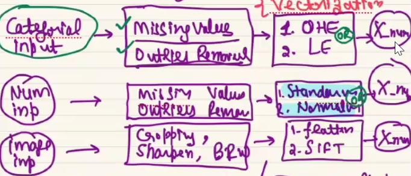
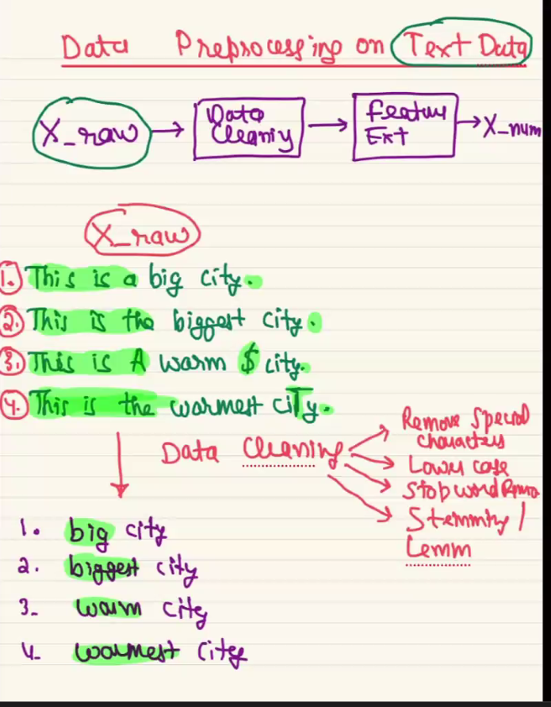

# Data-Scientist-Intern

## Agenda (12-02-2024)
1. KNN Imputation
2. Feature important using decision tree
3. Regulization also help us to understand feature important.

4. Hadoop
   + HFES - use to store the data in multiple partation
   + Map Reduce - help you to Process the data
   
#### Spark
+ Spark - new way to process data is spark not map reduce
+ Spark - also help us to analyse the data
+ best (HDFS + Spark)
+ HDFS - HDFS is use to store the large data
+ SparkSQL 
+ MLlibs for spark(similar to sklearn library)
+ Spark Streaming
+ you can apply spark on (csv, json, etc)

__Important notes__
 1. train and text score is used to find the overfitting and underfitting.
 2. if data become very big or data are in different places then doing with the pandas will be very difficult.

### Data Enginerring


#### HDFS
to take out the data from HDFS we need to use
- Apache SQOOP
- Apache Fluma
 
DA, ML, DL, NLP, CV, LLM
Spark
Cloud

#### from where data can be generated
1. IOT sensor
1. Google Form
1. Web Scrapping
1. more...

#### How to analyse and handle the big data
1. Map Reduce
2. Apache Spark

#### How to extract the data from HDFS
1. ApacheSQOOP
2. Apache Flume

#### Data Warehouse
1. AWS Redshift
1. Snowflack

#### dependence management(orchastrating)
1. Apache Airflow

#### Tools to take out data from data warehouse
1. SQL

Date - 13-02-2024
## Advance Stats DA
1. __Descriptive Stats__
   def : help us to describe the historial data.
   - Allow us to build reports(Summary of data)
   - Visulization
   - help to build Visual Dashboard
   - enemy: missing value, outliers

2. __Infrential Stats__
   - Estimation, appoximation
   Q. need of estimation and approximating something
   + A. Data collection is very expensive so we estimate the data
   + example 1: What is avg age of an indian citizen?(pandas, spark can easly find the mean)
   + example 2: total population of india just an estimate. 
   becz counting all people is very difficult

### Population 
   - collection of data
   - example- age of all the indian citizen

### sampling
- what is good sample?
   + low bias, random, varity.
- 
- subset of population, which represent the entire population.
- if you don't have enough money to collect the data we do sampling.
- we randomly collecting the data.
- it is not possible to collect the data of 1.4 billion of data, it is depend upon the budget of the company.

Q. what is the avg salary of the population?
Q. what is the avg age of the populaiton?
- do a data collection at very small scale becz
   + time consuming
   + collecting data is very expensive.

### Good Sampling Techinque
   1. **Uniform random sampling**:
      + it is randomly picking data points, giving equal chance to each and every data points.
      + in  case of salary, bias will come because of outliers.(there is sampling bias)

### Estimate can be corrupted:
1. wrong sampling techinque
1. sample contains outliers
1. sample size is not large enought

### samples mean

step to computer
1. pick 'm' sample of size 'n'
2. computer avg of each samples
3. we will end up getting, sampling distribution of samples mean.

### Estimation
- **1. Point estimation** - not so good 
- **2. Central limit theorum** is use to estimate, or make better inference/apporximation/estimation on the entire population using a small random sample.

### central limit theorum
   + find out point estimation of multiple
    sample
   + We take differnt samples from population and find out the average.
### Conculsion of central limit theorum
- more the data better is the estimate
- x-bar follow normal distribution.
- sampling distiributiion average is approxtly similar to mean of the population
- Normal distribution with mean and standard deviation
- samples mean(X) = poplulaiton mean
- 

> Sampling distributin follow the Normal distribution/Gaussain, there are 3 observation, learn it.

> Q. What is the avg height of gorilla? <br> 
ans - take sample and find it average

### to make sure if the data is follow normal discribution.

- we can tranform the any distribution to the normal distribution using

### Implement CLT on this data using python
```python
sns.histplot(population_df['age'], kde=True)
print('Number of rows: ', population_df.shape[0])
print('Population Mean: ', population_df['age'].mean())
```



```python
def sampling_distribution(data, sample_size, number_of_sample):
    sample_means = []
    for m in range(number_of_sample):
        sample = data.sample(n=sample_size)
        sample_means.append((sample_size, sample.mean()))
    sampling_distribution_df = pd.DataFrame(sample_means, columns=['n', 'mean'])

    print("*"*20, " R E P O R T ", "*"*20)
    print("Mean Check")
    print("Sampling Distribution Mean:", sampling_distribution_df["mean"].mean())
    print("Population Mean: ", data.mean())

    print()
    print("Standard Deviation Check")
    print("Sampling Distribution Std:", sampling_distribution_df["mean"].std())
    print("Population Std / (sample_size)**0.5:", data.std()/np.sqrt(sample_size))

    print("*"*55)
    
    return sampling_distribution_df
```

```python
def sampling_distribution_plot(data):
   fig, axes = plt.subplots(1, 2, figsize=(8, 3), constrained_layout=True)
   
   axes[0].set_title("Sampling Distribution")  # Add a title to the axes
   axes[0].set_xlabel('Mean')  # Add an x-label to the axes
   axes[0].set_ylabel('Density')  # Add a y-label to the axes

   sns.histplot(data, kde=True, ax=axes[0])
   
   stats.probplot(data, dist=stats.norm, plot=axes[1])
   axes[1].grid()
   
   plt.show()
```

```python
n=50
m=100

sampling_distribution_df = sampling_distribution(data=population_df['age'], sample_size=n, number_of_sample=m)

sampling_distribution_plot(data=sampling_distribution_df["mean"])
```


### Statistical Test in Python

link - https://github.com/bansalkanav/Machine_Learning_and_Deep_Learning/blob/master/Module%203%20-%20Advance%20Data%20Analysis%20and%20Statistics/6.%20Performing%20Statistical%20Test/statistical_test_practical_implementation.ipynb
Important Hypothesis Tests
There are many hypothesis tests. Here is a list of few most important tests:

### Univariate
- **Chi-Square Goodness-of-Fit Test**(cat): Tests whether the observed frequencies of categorical data match the expected frequencies according to a specified distribution. (univariant cat feature)
- **Shapiro-Wilk Test**(Numerical Continues): The Shapiro-Wilk test is a statistical test that checks whether a dataset follows a normal distribution.(less then 5000 data points, univ num continus feature)
-**Kolmogorov-Smirnov Test**: Tests whether a sample comes from a specific distribution (not limited to normal distribution). It can be used to compare any two continuous distributions.
One-Sample t-test: Tests whether the mean of a single sample is significantly different from a known or hypothesized population mean.

### Bivariate
- **Pearson Test**: Tests whether two samples have a linear relationship.(num-num), it show probabality linear relationship exist. Spearman's Rank Correlation (Alternative for Pearson Test)
- **Two-Sample t-test**: Compares the means of two related samples (e.g., before and after treatment) to determine if there is a significant difference.(cat-num, for 2 cardinate(height vs gender)) Mann-Whitney U Test (Wilcoxon Rank-Sum Test) (Alternative for 2-sample t-test)
- **ANOVA (one_way_anova)**: Compares the mean of three or more samples. It helps determine if there is a significant difference between the samples.(more then 2 cardinate(feature), Cat-num). Kruskal-Wallis Test (Alternative for One-Way ANOVA Test)
- **Chi-Square Test of Independence**: Tests whether there is a significant association between two categorical variables in a contingency table.(cat-cat) what kind of relationship is there?
(can apply on gender and count of gender)


